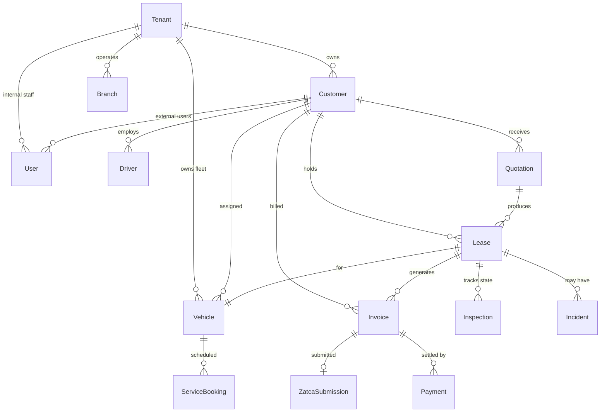
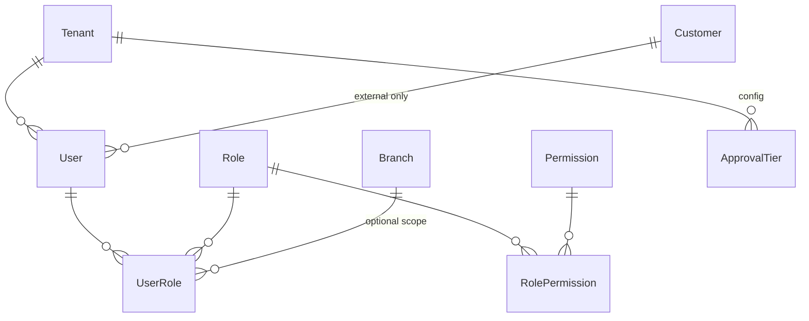
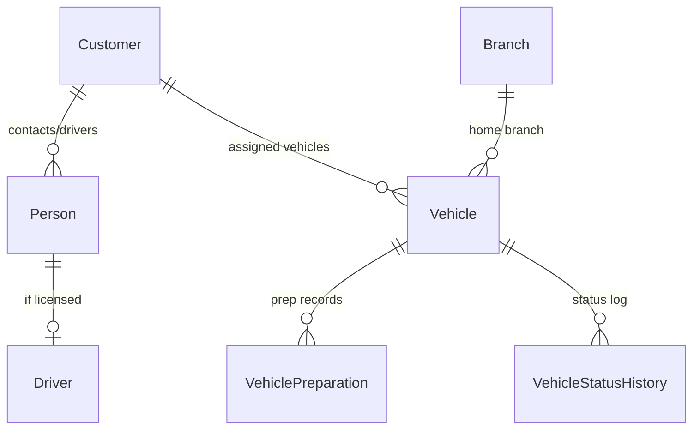
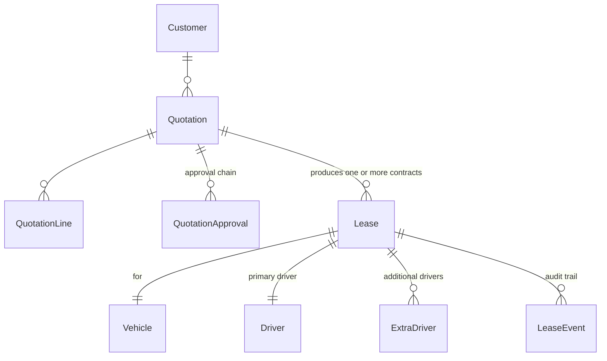
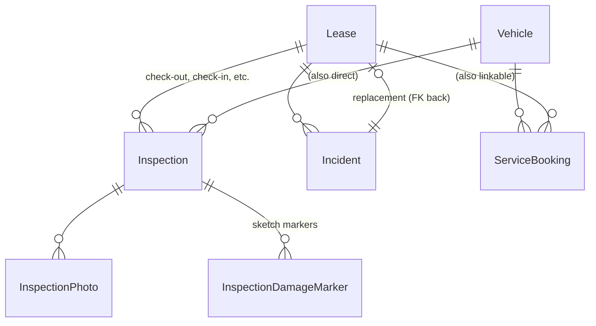
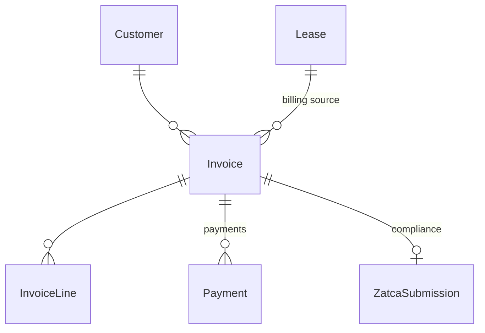
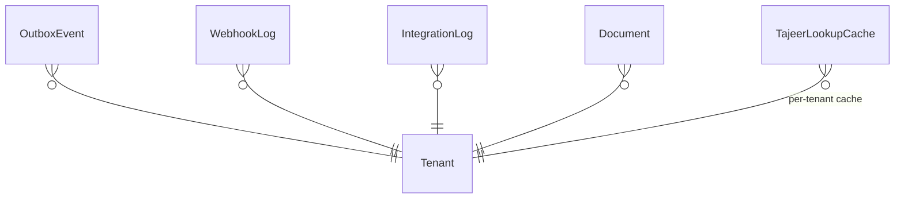

# 01 — Multi-tenancy & Domain Model

**Status**: Draft v0.1
**Phase**: Foundation (locks before Week 1 coding)
**Owner**: Architecture
**Last updated**: 2026-05-17

---

## 1. Purpose

This document is the source of truth for:

1. **Multi-tenancy model** — how data is isolated between leasing companies (future SaaS) and between customers within a leasing company.
2. **Domain entities** — the core business objects, their attributes, and their relationships.
3. **ERD** — entity-relationship diagrams per bounded context.
4. **Row-level security strategy** — how isolation is enforced at the database layer (defense in depth beyond app code).

Everything else (API contracts, state machines, adapter design) builds on top of this. **Get this right before writing schema code.**

---

## 2. Design principles

| # | Principle | Rationale |
|---|---|---|
| 1 | **Single-database, logical multi-tenancy** | Azure SQL with `TenantId` column + Row-Level Security. Cheap, simple, scales to thousands of tenants. Per-tenant DB only if a single customer demands data residency isolation. |
| 2 | **Two-level isolation** | `TenantId` isolates leasing companies (SaaS-future). `CustomerId` isolates corporate customers *within* a tenant. RLS enforces both. |
| 3 | **Tajeer is system of record for contracts** | We mirror Tajeer state into our `Lease` aggregate but never disagree with Tajeer. On conflict, Tajeer wins. |
| 4 | **Append-only audit trail** | Every state change on critical entities (Lease, Invoice, Quote, User, Vehicle status) writes a row to a `*_Event` table. Soft-delete only; never `DELETE`. |
| 5 | **External IDs separate from internal IDs** | Internal `Id` (BIGINT or UUID) for joins. External system IDs (`TajeerContractNumber`, `D365CustomerId`, `ZatcaUuid`) as separate columns with unique indexes. Never use external IDs as PKs. |
| 6 | **All money in halalas (or smallest unit), all dates in UTC** | `DECIMAL(18,2)` for SAR display, store as cents/halalas where possible. Time zone conversion at the presentation layer. Hijri dates derived, not stored. |
| 7 | **Outbox pattern for outbound integrations** | Never call Tajeer/D365/ZATCA inside a request transaction. Write to `OutboxEvent`, let a worker drain it. Guarantees at-least-once. |
| 8 | **Idempotency keys on every state-changing API** | Client-supplied or BFF-generated. Stored with response for 24h. No exceptions. |

---

## 3. Multi-tenancy model

### 3.1 The two levels of isolation

```
┌─────────────────────────────────────────────────────────────┐
│                       TENANT (leasing company)              │
│  e.g. "Logisti", "Theeb Rent A Car"                         │
│                                                             │
│  ┌──────────────────┐  ┌──────────────────┐  ┌──────────┐   │
│  │ Internal Users   │  │ CUSTOMER (corp)  │  │ CUSTOMER │   │
│  │ - Sales reps     │  │ "Aramco Fleet"   │  │  (B2C)   │   │
│  │ - Ops managers   │  │                  │  │ Ali Ahmad│   │
│  │ - Finance        │  │ ┌──────────────┐ │  │          │   │
│  │ - Admins         │  │ │ Fleet Admin  │ │  │ ┌──────┐ │   │
│  │                  │  │ │ Driver Users │ │  │ │ User │ │   │
│  │ See: ALL         │  │ │              │ │  │ │      │ │   │
│  │ customers in     │  │ │ See: ONLY    │ │  │ │ Sees │ │   │
│  │ tenant           │  │ │ their corp   │ │  │ │ own  │ │   │
│  │ (scoped by       │  │ │              │ │  │ │ data │ │   │
│  │  branch/region)  │  │ └──────────────┘ │  │ └──────┘ │   │
│  └──────────────────┘  └──────────────────┘  └──────────┘   │
└─────────────────────────────────────────────────────────────┘
```

- **TenantId**: A leasing company. Phase 1 has one tenant; architected for SaaS expansion.
- **CustomerId**: A lessee (corporate or individual). Many per tenant. RLS scopes external users to a single `CustomerId`.

### 3.2 User types

| Type | Belongs to | Scope of visibility | Auth provider (Phase 1) |
|---|---|---|---|
| `INTERNAL_STAFF` | Tenant | All customers in tenant (further scoped by branch + role) | Entra ID (corp SSO) |
| `EXTERNAL_FLEET_ADMIN` | Customer (corporate) | Only their Customer | Entra External ID (email + SMS OTP) |
| `EXTERNAL_DRIVER` | Customer | Only their assigned vehicle(s) | Entra External ID (email + SMS OTP) |
| `EXTERNAL_INDIVIDUAL` | Customer (B2C, where Customer.Type = INDIVIDUAL) | Only their Customer (which = themselves) | Entra External ID (email + SMS OTP) |
| `SYSTEM` | Tenant | Used for service-to-service calls, integration workers | Managed Identity / service principal |

> **Note**: B2C is modeled as `Customer.Type = INDIVIDUAL` with 1 user — not a separate entity. Simpler, fewer code paths.

### 3.3 JWT claim structure

The BFF reads these claims on every request and applies them to the SQL `SESSION_CONTEXT`:

```json
{
  "sub": "user-uuid",
  "tenant_id": "tenant-uuid",         // always present
  "user_type": "EXTERNAL_FLEET_ADMIN",
  "customer_id": "customer-uuid",     // present only for external users
  "branch_ids": ["br-1", "br-2"],     // present only for internal users with branch restriction; null = all branches
  "roles": ["fleet-admin"],
  "permissions": ["lease:read", "lease:create", ...]
}
```

### 3.4 SQL Row-Level Security

Every business table gets two columns:

```sql
TenantId    UNIQUEIDENTIFIER NOT NULL,   -- always
CustomerId  UNIQUEIDENTIFIER NULL,       -- when applicable (vehicle, lease, invoice, etc.)
```

A single security policy on each protected table enforces both predicates:

```sql
-- Predicate function: returns 1 if row is visible to current session
CREATE FUNCTION dbo.fn_TenancyPredicate(
    @TenantId UNIQUEIDENTIFIER,
    @CustomerId UNIQUEIDENTIFIER
) RETURNS TABLE WITH SCHEMABINDING
AS RETURN
    SELECT 1 AS result
    WHERE
        @TenantId = CAST(SESSION_CONTEXT(N'TenantId') AS UNIQUEIDENTIFIER)
        AND
        (
            -- Internal users (no customer scope) see all rows in tenant
            CAST(SESSION_CONTEXT(N'UserType') AS NVARCHAR(50))
                IN ('INTERNAL_STAFF', 'SYSTEM')
            OR
            -- External users see only their customer's rows
            @CustomerId = CAST(SESSION_CONTEXT(N'CustomerId') AS UNIQUEIDENTIFIER)
        );
GO

-- Apply to every protected table
CREATE SECURITY POLICY dbo.TenancyPolicy
    ADD FILTER  PREDICATE dbo.fn_TenancyPredicate(TenantId, CustomerId) ON dbo.Lease,
    ADD BLOCK   PREDICATE dbo.fn_TenancyPredicate(TenantId, CustomerId) ON dbo.Lease AFTER INSERT,
    ADD BLOCK   PREDICATE dbo.fn_TenancyPredicate(TenantId, CustomerId) ON dbo.Lease AFTER UPDATE,
    -- ... repeat for Vehicle, Invoice, Quotation, etc.
    WITH (STATE = ON);
GO
```

### 3.5 BFF middleware (sets SESSION_CONTEXT per request)

```csharp
// Pseudocode — runs on every authenticated request
public class TenancyMiddleware
{
    public async Task InvokeAsync(HttpContext ctx, SqlConnection conn, RequestDelegate next)
    {
        var user = ctx.User;
        var tenantId  = user.FindFirstValue("tenant_id");
        var userType  = user.FindFirstValue("user_type");
        var customerId = user.FindFirstValue("customer_id"); // may be null

        // Set session context — applies to all queries on this connection for this request
        await using var cmd = conn.CreateCommand();
        cmd.CommandText = @"
            EXEC sp_set_session_context @key=N'TenantId',   @value=@tid,  @read_only=1;
            EXEC sp_set_session_context @key=N'UserType',   @value=@ut,   @read_only=1;
            EXEC sp_set_session_context @key=N'CustomerId', @value=@cid,  @read_only=1;";
        // ... parameters ...
        await cmd.ExecuteNonQueryAsync();

        await next(ctx);
    }
}
```

**Critical invariants**:
- `@read_only=1` so app code cannot mutate context mid-request.
- Connection pooling: session context is per-connection. Use a fresh connection per HTTP request (or reset context on connection return).
- Integration workers run as `SYSTEM` and may bypass RLS — but they must still set `TenantId` explicitly.

### 3.6 What RLS does NOT protect against

- A bug in the BFF that sets wrong `TenantId` → wrong tenant's data exposed. **Mitigation**: integration test suite that runs queries under each persona and verifies row counts.
- Internal staff abusing legitimate access. **Mitigation**: append-only `AuditLog` table records every read of sensitive entities (renter Iqama, license, IBAN).
- Direct DBA access. **Mitigation**: production DB access via PIM with break-glass approval + alert.

---

## 4. Bounded contexts

The domain splits into 8 contexts. Each owns its tables; cross-context references use IDs only (no FKs across contexts in the long run — keeps refactoring possible if we extract microservices later).

| Context | Owns | Key entities |
|---|---|---|
| **Identity & Access** | Users, roles, permissions, tenancy | Tenant, User, Role, Permission, UserRole, ApiClient |
| **Customers & People** | Lessees (corp + individual), drivers, contacts | Customer, Person, Driver, ContactInfo |
| **Fleet** | Vehicles, branches, prep records | Branch, Vehicle, VehiclePreparation, VehicleStatusHistory |
| **Sales** | Quotations, approvals | Quotation, QuotationLine, QuotationApproval, ApprovalTier |
| **Leasing** | Lease contracts (Tajeer mirror) | Lease, LeaseEvent, ExtraDriver, RentPolicySelection |
| **Operations** | E-Checks, incidents, service | Inspection, InspectionPhoto, InspectionDamageMarker, Incident, ServiceBooking |
| **Billing** | Invoices, payments, ZATCA | Invoice, InvoiceLine, Payment, ZatcaSubmission |
| **Integration & Reference** | Outbox, webhooks, cached lookups, documents | OutboxEvent, WebhookLog, IntegrationLog, Document, TajeerLookupCache |

---

## 5. Entity definitions

> **Conventions**: All tables get `Id UNIQUEIDENTIFIER PK DEFAULT NEWSEQUENTIALID()`, `TenantId UUID NOT NULL`, `CustomerId UUID NULL` (where applicable), `CreatedAtUtc DATETIME2`, `CreatedBy UUID`, `UpdatedAtUtc DATETIME2`, `UpdatedBy UUID`, `RowVersion ROWVERSION` (optimistic concurrency). These are omitted from per-entity tables below for brevity.

### 5.1 Identity & Access

#### `Tenant`
| Field | Type | Notes |
|---|---|---|
| Name | NVARCHAR(200) | Leasing company legal name |
| ArName | NVARCHAR(200) | Arabic name |
| CrNumber | NVARCHAR(20) | KSA Commercial Registration |
| VatNumber | NVARCHAR(20) | ZATCA VAT registration (15 digits) |
| MoiNumber | NVARCHAR(20) | MOI 700 number |
| TajeerClientId | NVARCHAR(100) | Rabet credentials per tenant |
| ZatcaCsidProduction | NVARCHAR(MAX) | Production CSID (encrypted, Key Vault ref) |
| ZatcaCsidSandbox | NVARCHAR(MAX) | Sandbox CSID |
| IsActive | BIT | |

#### `User`
| Field | Type | Notes |
|---|---|---|
| ExternalAuthId | NVARCHAR(200) | Entra ID `sub` claim — unique per IdP |
| UserType | NVARCHAR(30) | `INTERNAL_STAFF`, `EXTERNAL_FLEET_ADMIN`, `EXTERNAL_DRIVER`, `EXTERNAL_INDIVIDUAL`, `SYSTEM` |
| CustomerId | UUID NULL | Set for external users only |
| FullNameAr | NVARCHAR(200) | |
| FullNameEn | NVARCHAR(200) | |
| Email | NVARCHAR(200) | Unique per tenant |
| Mobile | NVARCHAR(20) | E.164 format, `9665...` for KSA |
| PreferredLanguage | CHAR(2) | `ar` or `en` |
| LastLoginUtc | DATETIME2 NULL | |
| IsActive | BIT | |

#### `Role`
| Field | Type | Notes |
|---|---|---|
| Code | NVARCHAR(50) | `sales-rep`, `fleet-admin`, `driver`, `finance`, `admin`, etc. |
| NameAr / NameEn | NVARCHAR(100) | |
| IsSystemRole | BIT | System roles cannot be deleted |

#### `Permission`
| Field | Type | Notes |
|---|---|---|
| Code | NVARCHAR(100) | `lease:read`, `lease:create`, `quote:approve:tier-1`, etc. — namespaced |
| Description | NVARCHAR(500) | |

#### `RolePermission`
| Field | Type | Notes |
|---|---|---|
| RoleId | UUID FK Role | |
| PermissionId | UUID FK Permission | |
| (composite PK) | | |

#### `UserRole`
| Field | Type | Notes |
|---|---|---|
| UserId | UUID FK User | |
| RoleId | UUID FK Role | |
| BranchId | UUID FK Branch NULL | If set, role applies only when working in this branch |
| (composite PK with BranchId nullable) | | |

#### `ApprovalTier` (config table)
| Field | Type | Notes |
|---|---|---|
| TierLevel | TINYINT | 1, 2, 3 |
| MinAmount / MaxAmount | DECIMAL(18,2) | SAR threshold |
| RequiredRoleCode | NVARCHAR(50) | e.g. `sales-manager`, `regional-director` |
| AppliesTo | NVARCHAR(20) | `QUOTATION`, `DISCOUNT`, `EARLY_TERMINATION` |

#### `ApiClient` (for technical integrations — Tajeer-style API user)
| Field | Type | Notes |
|---|---|---|
| ClientCode | NVARCHAR(50) | |
| HashedSecret | NVARCHAR(500) | |
| Scopes | NVARCHAR(MAX) | JSON array of allowed scopes |
| LastUsedUtc | DATETIME2 NULL | |
| IsActive | BIT | |

---

### 5.2 Customers & People

#### `Customer`
| Field | Type | Notes |
|---|---|---|
| Type | NVARCHAR(20) | `CORPORATE` or `INDIVIDUAL` |
| LegalNameAr / LegalNameEn | NVARCHAR(200) | |
| CrNumber | NVARCHAR(20) NULL | For corporate |
| VatNumber | NVARCHAR(20) NULL | For B2B billing |
| NationalAddress | NVARCHAR(500) NULL | Saudi National Address (Wasel) |
| BillingEmail | NVARCHAR(200) | |
| BillingMobile | NVARCHAR(20) | |
| PrimaryContactPersonId | UUID FK Person NULL | |
| AccountManagerUserId | UUID FK User NULL | Internal sales rep owner |
| D365CustomerId | NVARCHAR(50) NULL | F&O Customer Account number, set after sync |
| D365CrmContactId | NVARCHAR(50) NULL | CRM Contact GUID |
| CreditLimitSar | DECIMAL(18,2) NULL | |
| Status | NVARCHAR(20) | `PROSPECT`, `ACTIVE`, `SUSPENDED`, `CLOSED` |

#### `Person`
| Field | Type | Notes |
|---|---|---|
| CustomerId | UUID FK Customer NULL | NULL for system-wide drivers (rare) |
| IdType | NVARCHAR(20) | `NATIONAL_ID`, `IQAMA`, `GCC_ID`, `PASSPORT` — Tajeer idTypeCode mapping |
| IdNumber | NVARCHAR(20) | Encrypted at rest (Always Encrypted column) |
| IdExpiryDate | DATE NULL | |
| HijriBirthDate | INT NULL | Tajeer format YYYYMMDD |
| GregorianBirthDate | DATE NULL | |
| Nationality | NVARCHAR(50) | ISO country code |
| FullNameAr / FullNameEn | NVARCHAR(200) | From Yakeen |
| Mobile | NVARCHAR(20) | |
| Email | NVARCHAR(200) NULL | |
| Address | NVARCHAR(500) | |
| YakeenLastSyncUtc | DATETIME2 NULL | When we last refreshed from Yakeen (via Tajeer) |

#### `Driver`
| Field | Type | Notes |
|---|---|---|
| PersonId | UUID FK Person | One Person can be one Driver |
| DriverLicenseNumber | NVARCHAR(20) | |
| DriverLicenseType | NVARCHAR(20) | Tajeer driveLicenseTypeCode |
| LicenseExpiryDate | DATE | Blocks check-out if expired |
| AssignedVehicleId | UUID FK Vehicle NULL | Current primary assignment |
| Status | NVARCHAR(20) | `ACTIVE`, `SUSPENDED`, `BLACKLISTED` |

---

### 5.3 Fleet

#### `Branch`
| Field | Type | Notes |
|---|---|---|
| TajeerBranchId | BIGINT | Synced from Tajeer `/branch/all` |
| LicenseNumber | NVARCHAR(50) | TGA license |
| NameAr / NameEn | NVARCHAR(200) | |
| CityAr / CityEn | NVARCHAR(100) | |
| RegionAr / RegionEn | NVARCHAR(100) | |
| Address | NVARCHAR(500) | |
| IsMain | BIT | Main branch flag |
| LicenseExpiryDate | DATE | Tajeer requires non-expired license to issue contracts |
| IsActive | BIT | |

#### `Vehicle`
| Field | Type | Notes |
|---|---|---|
| CustomerId | UUID FK Customer NULL | NULL = fleet-owned (not yet attached to customer); set after delivery |
| BranchId | UUID FK Branch | Home branch |
| PlateNumber | NVARCHAR(20) | Tajeer plate format: e.g. `0008 أ ي ي` (old chars) |
| NewPlateNumber | NVARCHAR(20) | New chars (`ا`/`ى`) per Tajeer v9.3 — primary going forward |
| PlateType | TINYINT | 1=private, 3=private transport (Tajeer plateType) |
| Vin | NVARCHAR(20) | Chassis number |
| BrandAr / BrandEn | NVARCHAR(100) | From Naql/Yakeen |
| ModelAr / ModelEn | NVARCHAR(100) | |
| Color | NVARCHAR(50) | |
| ManufactureYear | INT | |
| OwnerNumber | NVARCHAR(20) | Naql owner ID (leasing company's commercial number) |
| InsuranceNumber | NVARCHAR(50) | |
| InsuranceExpiryDate | DATE | |
| OperationCardNumber | NVARCHAR(50) | |
| OperationCardExpiryDate | DATE | |
| MvpiExpiryDate | DATE NULL | Periodic Vehicle Inspection |
| OilType | NVARCHAR(50) | |
| OilChangeDate | DATE | |
| OilChangeKmDistance | INT | |
| FuelType | TINYINT | Tajeer fuelTypeCode |
| Status | NVARCHAR(30) | `NEW`, `IN_PREPARATION`, `READY`, `RESERVED`, `UNDER_CONTRACT`, `IN_SERVICE`, `IN_WORKSHOP`, `DECOMMISSIONED`, `WRITTEN_OFF` (see [doc 02 §4.2](./02-state-machines-and-sagas.md#42-vehicle) for state machine) |
| D365FixedAssetId | NVARCHAR(50) NULL | After Phase 2 sync |

#### `VehiclePreparation`
| Field | Type | Notes |
|---|---|---|
| VehicleId | UUID FK Vehicle | |
| StartedAtUtc / CompletedAtUtc | DATETIME2 | |
| PlateInstalledAtUtc | DATETIME2 NULL | |
| GpsDeviceSerial | NVARCHAR(100) NULL | If GPS installed during prep |
| Accessories | NVARCHAR(MAX) NULL | JSON: list of accessories |
| InitialOdometerKm | INT | |
| PreparedByUserId | UUID FK User | |
| Notes | NVARCHAR(MAX) | |

#### `VehicleStatusHistory` (append-only)
| Field | Type | Notes |
|---|---|---|
| VehicleId | UUID FK Vehicle | |
| FromStatus / ToStatus | NVARCHAR(30) | |
| ChangedAtUtc | DATETIME2 | |
| ChangedBy | UUID FK User | |
| Reason | NVARCHAR(500) | |
| RelatedEntityType / RelatedEntityId | NVARCHAR(50) / UUID NULL | e.g. `LEASE` / leaseId |

---

### 5.4 Sales (Quotation)

#### `Quotation`
| Field | Type | Notes |
|---|---|---|
| QuoteNumber | NVARCHAR(30) | `Q-{tenant-code}-{yyyymm}-{seq}` |
| CustomerId | UUID FK Customer | |
| Status | NVARCHAR(30) | `DRAFT`, `PENDING_APPROVAL`, `APPROVED`, `SENT_TO_CUSTOMER`, `ACCEPTED`, `REJECTED`, `EXPIRED`, `WITHDRAWN` |
| AccountManagerId | UUID FK User | Owning sales rep |
| QuoteDate | DATE | |
| ValidUntilDate | DATE | |
| ContractType | NVARCHAR(20) | `DAILY`, `HOURLY`, `LONG_TERM_LEASE` |
| EstimatedDurationMonths | INT | |
| SubTotalSar | DECIMAL(18,2) | |
| DiscountPercent | DECIMAL(5,2) | |
| VatSar | DECIMAL(18,2) | |
| TotalSar | DECIMAL(18,2) | |
| TermsAndConditionsMd | NVARCHAR(MAX) | Versioned T&C, markdown |
| PdfBlobUri | NVARCHAR(500) NULL | Generated quote PDF |
| AcceptedAtUtc | DATETIME2 NULL | |
| AcceptedByCustomerSignature | NVARCHAR(MAX) NULL | If e-sign collected |

#### `QuotationLine`
| Field | Type | Notes |
|---|---|---|
| QuotationId | UUID FK Quotation | |
| LineNumber | INT | |
| ItemType | NVARCHAR(20) | `VEHICLE_RENTAL`, `INSURANCE`, `ADDITIONAL_DRIVER`, `GPS`, `OTHER` |
| Description | NVARCHAR(500) | |
| VehicleSpecRef | NVARCHAR(100) NULL | E.g. "Toyota Camry 2025" or specific VehicleId if pre-allocated |
| Quantity | INT | |
| UnitPriceSar | DECIMAL(18,2) | |
| DiscountPercent | DECIMAL(5,2) | |
| LineTotalSar | DECIMAL(18,2) | Computed |

#### `QuotationApproval`
| Field | Type | Notes |
|---|---|---|
| QuotationId | UUID FK Quotation | |
| TierLevel | TINYINT | 1, 2, 3 |
| RequiredRoleCode | NVARCHAR(50) | Snapshotted from ApprovalTier at submission time |
| AssignedUserId | UUID FK User NULL | Specific approver if delegated |
| Status | NVARCHAR(20) | `PENDING`, `APPROVED`, `REJECTED`, `RECALLED` |
| DecisionAtUtc | DATETIME2 NULL | |
| DecidedByUserId | UUID FK User NULL | |
| Comment | NVARCHAR(2000) NULL | |

---

### 5.5 Leasing

#### `Lease` (our wrapper around Tajeer contract)
| Field | Type | Notes |
|---|---|---|
| QuotationId | UUID FK Quotation NULL | Source quote, if from sales flow |
| CustomerId | UUID FK Customer | |
| VehicleId | UUID FK Vehicle | |
| PrimaryDriverId | UUID FK Driver | The renter / primary driver |
| TajeerContractNumber | BIGINT UNIQUE | Tajeer's contract number — system of record |
| TajeerToken | NVARCHAR(100) | UUID returned with contractNumber (used for issuance URL) |
| TajeerIssuanceUrl | NVARCHAR(500) NULL | Until customer completes on Tajeer page |
| Status | NVARCHAR(30) | `PENDING_ISSUANCE`, `ACTIVE`, `EXTENDED`, `SUSPENDED`, `CLOSED`, `CANCELLED`, `EXPIRED_DRAFT` (the 12h auto-cancel) |
| TajeerStatusCode | INT NULL | Mirrors Tajeer contractStatusCode |
| ContractType | NVARCHAR(20) | `DAILY`, `DAILY_WITH_DRIVER`, `HOURLY`, `HOURLY_WITH_DRIVER` |
| ContractStartUtc / ContractEndUtc | DATETIME2 | |
| ContractActualEndUtc | DATETIME2 NULL | Set on close |
| WorkingBranchId / ReceiveBranchId / ReturnBranchId | UUID FK Branch | |
| ActualReturnBranchId | UUID FK Branch NULL | |
| AllowedKmPerDay / AllowedKmPerHour | INT | |
| UnlimitedKm | BIT | |
| AllowedLateHours | INT | 0–24 |
| RentDayCost / RentHourCost | DECIMAL(18,2) | |
| FullFuelCostSar | DECIMAL(18,2) | |
| ExtraKmCostSar | DECIMAL(18,4) | Per-km |
| AdditionalCoverageCostSar | DECIMAL(18,2) | |
| InternationalAuthorizationCostSar | DECIMAL(18,2) NULL | |
| VehicleTransferCostSar | DECIMAL(18,2) NULL | |
| ExtraDriverCostSar | DECIMAL(18,2) NULL | |
| DiscountPercent | DECIMAL(5,2) | |
| PaidSar | DECIMAL(18,2) | |
| TotalSar | DECIMAL(18,2) | |
| VatSar | DECIMAL(18,2) | |
| RemainingSar | DECIMAL(18,2) | |
| PaymentMethodCode | INT | Tajeer paymentMethodCode |
| EnduranceAmountSar | DECIMAL(18,2) | Deductible — frozen after first save |
| OperatorUserId | UUID FK User | Sales/ops user who created the contract |
| ExtensionCount | INT DEFAULT 0 | Max 25 per Tajeer rules |
| SuspensionReasonCode | INT NULL | 1=non-traffic accident, 2=financial claims |
| ClosureReasonCode | INT NULL | Tajeer §8.7 |
| ClosureSubReasonCode | INT NULL | |
| MojEnabled | BIT NULL | For financial-claim suspensions |
| ContractPdfBlobUri | NVARCHAR(500) NULL | Cached from Tajeer GET PDF endpoint |

#### `LeaseEvent` (append-only audit)
| Field | Type | Notes |
|---|---|---|
| LeaseId | UUID FK Lease | |
| EventType | NVARCHAR(50) | `SAVED`, `ISSUANCE_LINK_SENT`, `ISSUED`, `EXTENDED`, `SUSPENDED`, `CLOSED`, `CANCELLED`, `PAYMENT_UPDATED`, `STATE_RECONCILED` |
| EventAtUtc | DATETIME2 | |
| TajeerEventId | NVARCHAR(100) NULL | If triggered by Tajeer webhook |
| Payload | NVARCHAR(MAX) | JSON snapshot of relevant data |
| ActorUserId | UUID FK User NULL | Internal user who triggered, NULL if Tajeer-initiated |

#### `ExtraDriver` (on a lease)
| Field | Type | Notes |
|---|---|---|
| LeaseId | UUID FK Lease | |
| PersonId | UUID FK Person | |
| CostSar | DECIMAL(18,2) | |

---

### 5.6 Operations

#### `Inspection` (E-Check)
| Field | Type | Notes |
|---|---|---|
| VehicleId | UUID FK Vehicle | |
| LeaseId | UUID FK Lease NULL | NULL for prep inspections |
| Type | NVARCHAR(20) | `PRE_DELIVERY`, `CHECK_OUT`, `CHECK_IN`, `INCIDENT`, `PERIODIC` |
| PerformedAtUtc | DATETIME2 | |
| PerformedByUserId | UUID FK User | |
| OdometerKm | INT | |
| FuelLevel | TINYINT | Tajeer availableFuel: 1=full, 2=3/4, 3=1/2, 4=1/4, 5=empty |
| AcCondition / RadioStereo / ScreenCondition | TINYINT | Tajeer lookup values |
| SpeedometerCondition / KeysCondition | TINYINT | |
| CarSeatsCondition | TINYINT | |
| SafetyTriangle / FireExtinguisher / FirstAidKit / SpareTireTools | TINYINT | |
| TiresCondition / SpareTireCondition | TINYINT | |
| Other1 / Other2 | NVARCHAR(200) NULL | |
| Notes | NVARCHAR(1000) NULL | Max 130 chars enforced by Tajeer |
| SketchInfoJson | NVARCHAR(MAX) | Tajeer-format damage marker JSON |
| RenterSignatureBlobUri | NVARCHAR(500) NULL | E-sign image, if collected |

#### `InspectionPhoto`
| Field | Type | Notes |
|---|---|---|
| InspectionId | UUID FK Inspection | |
| BlobUri | NVARCHAR(500) | |
| Sequence | INT | Display order |
| AiDamageDetectionJson | NVARCHAR(MAX) NULL | Phase 3 — Azure AI Vision output |

#### `InspectionDamageMarker` (denormalized from SketchInfoJson for queries)
| Field | Type | Notes |
|---|---|---|
| InspectionId | UUID FK Inspection | |
| Type | NVARCHAR(30) | `small-scratch`, `deep-scratch`, `very-deep-scratch`, `bend-in-body` |
| PositionX | DECIMAL(8,4) | 0–893 (Tajeer canvas width) |
| PositionY | DECIMAL(8,4) | 0–429 (Tajeer canvas height) |

#### `Incident`
| Field | Type | Notes |
|---|---|---|
| LeaseId | UUID FK Lease | |
| VehicleId | UUID FK Vehicle | |
| ReportedByPersonId | UUID FK Person | Driver, customer, or rep |
| ReportedAtUtc | DATETIME2 | |
| IncidentTimeUtc | DATETIME2 | When it happened |
| Type | NVARCHAR(30) | `TRAFFIC_ACCIDENT`, `NON_TRAFFIC_DAMAGE`, `BREAKDOWN`, `THEFT`, `VANDALISM`, `OTHER` |
| Severity | NVARCHAR(20) | `MINOR`, `MAJOR`, `TOTAL_LOSS` |
| LocationLat / LocationLng | DECIMAL(9,6) NULL | |
| LocationDescription | NVARCHAR(500) | |
| Description | NVARCHAR(MAX) | |
| PoliceReportNumber | NVARCHAR(50) NULL | |
| InsuranceClaimNumber | NVARCHAR(50) NULL | |
| Status | NVARCHAR(20) | `OPEN`, `UNDER_INVESTIGATION`, `RESOLVED`, `CLOSED` |
| RequiresReplacement | BIT | |
| ReplacementLeaseId | UUID FK Lease NULL | If a swap was triggered |

#### `ServiceBooking`
| Field | Type | Notes |
|---|---|---|
| VehicleId | UUID FK Vehicle | |
| LeaseId | UUID FK Lease NULL | |
| BookedByUserId | UUID FK User | |
| ServiceType | NVARCHAR(30) | `OIL_CHANGE`, `PMS_15K`, `PMS_30K`, `REPAIR`, `INSPECTION`, `OTHER` |
| ScheduledAtUtc | DATETIME2 | |
| ServiceBranchId | UUID FK Branch | Or external workshop reference |
| ExternalWorkshopRef | NVARCHAR(100) NULL | Car Servicing App booking ID |
| EstimatedCompletionUtc | DATETIME2 NULL | |
| ActualCompletionUtc | DATETIME2 NULL | |
| Status | NVARCHAR(20) | `SCHEDULED`, `IN_PROGRESS`, `COMPLETED`, `CANCELLED` |
| CostSar | DECIMAL(18,2) NULL | |
| Notes | NVARCHAR(MAX) | |

---

### 5.7 Billing

#### `Invoice`
| Field | Type | Notes |
|---|---|---|
| InvoiceNumber | NVARCHAR(30) | `INV-{tenant-code}-{yyyymm}-{seq}` |
| LeaseId | UUID FK Lease NULL | Most invoices link to a lease; some are standalone (deposits, fines pass-through) |
| CustomerId | UUID FK Customer | |
| InvoiceType | NVARCHAR(20) | `STANDARD`, `CREDIT_NOTE`, `DEBIT_NOTE`, `DEPOSIT`, `FINE_PASSTHROUGH` |
| IssueDate | DATE | |
| DueDate | DATE | |
| SubTotalSar | DECIMAL(18,2) | |
| DiscountSar | DECIMAL(18,2) | |
| VatSar | DECIMAL(18,2) | |
| TotalSar | DECIMAL(18,2) | |
| PaidSar | DECIMAL(18,2) | |
| Currency | CHAR(3) | `SAR` |
| Status | NVARCHAR(20) | `DRAFT`, `ISSUED`, `PARTIALLY_PAID`, `PAID`, `OVERDUE`, `VOID`, `DISPUTED` |
| PdfBlobUri | NVARCHAR(500) NULL | |
| D365InvoiceId | NVARCHAR(50) NULL | F&O Customer Invoice ID, set after sync |

#### `InvoiceLine`
| Field | Type | Notes |
|---|---|---|
| InvoiceId | UUID FK Invoice | |
| LineNumber | INT | |
| Description | NVARCHAR(500) | |
| Quantity | DECIMAL(18,4) | |
| UnitPriceSar | DECIMAL(18,2) | |
| LineTotalSar | DECIMAL(18,2) | |
| VatRate | DECIMAL(5,2) | Usually 15 for KSA |
| ZatcaCategoryCode | NVARCHAR(10) | ZATCA category for VAT classification |

#### `Payment`
| Field | Type | Notes |
|---|---|---|
| InvoiceId | UUID FK Invoice NULL | NULL for unallocated payments |
| LeaseId | UUID FK Lease NULL | For lease-level deposits before invoice |
| PaymentDate | DATE | |
| AmountSar | DECIMAL(18,2) | |
| Method | NVARCHAR(20) | `CASH`, `CARD`, `BANK_TRANSFER`, `MADA`, `STC_PAY`, `APPLE_PAY`, `OTHER` |
| MethodSubType | NVARCHAR(50) NULL | Tajeer otherPaymentMethodCode mapping |
| Reference | NVARCHAR(100) NULL | Bank ref, card auth code |
| RecordedByUserId | UUID FK User | |
| Status | NVARCHAR(20) | `PENDING`, `CLEARED`, `BOUNCED`, `REFUNDED` |

#### `ZatcaSubmission` (one per invoice — clearance or reporting)
| Field | Type | Notes |
|---|---|---|
| InvoiceId | UUID FK Invoice | |
| InvoiceType | NVARCHAR(20) | `B2B_CLEARANCE` (real-time), `B2C_REPORTING` (within 24h) |
| Environment | NVARCHAR(10) | `SANDBOX`, `PROD` |
| UblXml | NVARCHAR(MAX) | The signed UBL 2.1 XML sent |
| QrCodeTlv | NVARCHAR(MAX) | TLV-encoded base64 QR data |
| PreviousInvoiceHash | NVARCHAR(200) | PIH chain — links to prior invoice's hash |
| InvoiceHash | NVARCHAR(200) | This invoice's hash, fed to next |
| SubmittedAtUtc | DATETIME2 NULL | |
| SubmissionAttempts | INT DEFAULT 0 | |
| Status | NVARCHAR(20) | `PENDING`, `CLEARED`, `REPORTED`, `REJECTED`, `WARNING` |
| ZatcaUuid | NVARCHAR(100) NULL | Returned by ZATCA on success |
| ZatcaResponseJson | NVARCHAR(MAX) NULL | Full response for audit |
| LastErrorCode | NVARCHAR(50) NULL | |

---

### 5.8 Integration & Reference

#### `OutboxEvent` (outbox pattern for outbound integrations)
| Field | Type | Notes |
|---|---|---|
| AggregateType | NVARCHAR(50) | `Lease`, `Invoice`, `Customer` etc. |
| AggregateId | UUID | |
| EventType | NVARCHAR(50) | `LEASE_ISSUED`, `INVOICE_CLEARED`, etc. |
| Payload | NVARCHAR(MAX) | JSON |
| TargetSystem | NVARCHAR(20) | `TAJEER`, `D365_FO`, `D365_CRM`, `ZATCA`, `UNIFONIC` |
| CreatedAtUtc | DATETIME2 | |
| ProcessedAtUtc | DATETIME2 NULL | |
| Attempts | INT DEFAULT 0 | |
| LastErrorAtUtc | DATETIME2 NULL | |
| LastError | NVARCHAR(MAX) NULL | |
| Status | NVARCHAR(20) | `PENDING`, `PROCESSING`, `COMPLETED`, `FAILED`, `DEAD_LETTER` |

#### `WebhookLog` (inbound webhook audit)
| Field | Type | Notes |
|---|---|---|
| Source | NVARCHAR(20) | `TAJEER`, `D365`, `ZATCA` |
| ExternalEventId | NVARCHAR(100) | For idempotent dedup (Tajeer `id` field) |
| EventType | NVARCHAR(50) | |
| ReferenceId | NVARCHAR(100) | E.g. Tajeer contractNumber |
| Payload | NVARCHAR(MAX) | Raw body |
| SignatureValid | BIT | |
| ReceivedAtUtc | DATETIME2 | |
| ProcessedAtUtc | DATETIME2 NULL | |
| ProcessingError | NVARCHAR(MAX) NULL | |
| **UNIQUE INDEX** (Source, ExternalEventId) | | Dedup |

#### `IntegrationLog` (outbound calls audit — for debugging & SLA tracking)
| Field | Type | Notes |
|---|---|---|
| TargetSystem | NVARCHAR(20) | |
| Operation | NVARCHAR(100) | E.g. `Tajeer.SaveContract` |
| CorrelationId | NVARCHAR(100) | W3C traceparent |
| RequestBodyHash | CHAR(64) | SHA-256 for dedup / log size |
| ResponseStatus | INT | HTTP code |
| ResponseTimeMs | INT | |
| Success | BIT | |
| ErrorCode | NVARCHAR(50) NULL | Tajeer errorKey if any |
| AttemptedAtUtc | DATETIME2 | |

#### `Document` (uploaded files)
| Field | Type | Notes |
|---|---|---|
| RelatedEntityType | NVARCHAR(50) | `Person`, `Vehicle`, `Lease`, `Customer`, `Incident` |
| RelatedEntityId | UUID | |
| DocumentType | NVARCHAR(30) | `IQAMA`, `LICENSE`, `ISTIMARA`, `INSURANCE_CERT`, `POLICE_REPORT`, `CONTRACT`, `OTHER` |
| BlobUri | NVARCHAR(500) | |
| OriginalFileName | NVARCHAR(500) | |
| MimeType | NVARCHAR(100) | |
| FileSizeBytes | BIGINT | |
| UploadedByUserId | UUID FK User | |
| VirusScanStatus | NVARCHAR(20) | `PENDING`, `CLEAN`, `INFECTED` |
| ExpiryDate | DATE NULL | If doc has expiry (license, insurance) — for reminder workflows |

#### `TajeerLookupCache` (cached reference data from Tajeer)
| Field | Type | Notes |
|---|---|---|
| LookupType | NVARCHAR(50) | `rent-policies`, `extended-coverage`, `branches`, `payment-method`, `closure-reasons`, etc. |
| ExternalCode | NVARCHAR(50) | The id/code from Tajeer |
| NameAr / NameEn | NVARCHAR(500) | |
| MetadataJson | NVARCHAR(MAX) | Type-specific extra data |
| LastSyncedUtc | DATETIME2 | |
| IsActive | BIT | |
| **UNIQUE INDEX** (LookupType, ExternalCode) | | |

---

## 6. ERD diagrams

### 6.1 High-level (cross-context relationships)



### 6.2 Identity & Access



### 6.3 Customers & Fleet



### 6.4 Sales & Leasing



### 6.5 Operations



### 6.6 Billing



### 6.7 Integration plumbing



---

## 7. Key invariants & business rules

### 7.1 Lease invariants

1. A `Vehicle` can have at most **one** `Lease` in status `ACTIVE`, `EXTENDED`, `SUSPENDED`, or `PENDING_ISSUANCE` at any time.
   - Enforce via unique filtered index: `CREATE UNIQUE INDEX UX_Vehicle_OneActiveLease ON Lease(VehicleId) WHERE Status IN ('PENDING_ISSUANCE','ACTIVE','EXTENDED','SUSPENDED')`.
2. A `Lease` cannot transition to `ACTIVE` without a `CHECK_OUT` `Inspection` row.
3. A `Lease` cannot be `CLOSED` without a `CHECK_IN` `Inspection` row OR a `Suspend` → `Close` sequence.
4. `TajeerContractNumber` is set only after Tajeer's Save Contract API returns success; until then, status is local-only.
5. `ExtensionCount` <= 25 (Tajeer rule).
6. `EnduranceAmountSar` is frozen after first Save Contract — never updateable (per Tajeer §9.1).

### 7.2 Quotation invariants

1. A `Quotation` cannot be `SENT_TO_CUSTOMER` until all `QuotationApproval` rows for required tiers are `APPROVED`.
2. Required approval tiers are calculated at submission time based on `TotalSar` and `ApprovalTier` config — snapshotted (config changes don't retroactively affect in-flight quotes).
3. A `Quotation` in `ACCEPTED` status becomes immutable; produce a `CREDIT_QUOTATION` / new quote for changes.

### 7.3 Vehicle status invariants

1. Status transitions are constrained (state machine, see doc 02):
   - `NEW` → `IN_PREPARATION` → `READY` → `UNDER_CONTRACT` ↔ `IN_SERVICE` ↔ `IN_WORKSHOP`
   - Terminal states: `DECOMMISSIONED`, `WRITTEN_OFF`
2. Every status change writes a `VehicleStatusHistory` row.
3. A `Vehicle` cannot be assigned to a `Customer` until its current `VehiclePreparation` is `Completed`.

### 7.4 Invoice / ZATCA invariants

1. PIH (previous invoice hash) chain is per-tenant, ordered by `IssueDate, InvoiceNumber`. Breaking the chain is a critical alert.
2. A `B2B` invoice cannot be marked `ISSUED` until ZATCA returns `CLEARED` (synchronous flow).
3. A `B2C` invoice can be issued immediately but must be reported to ZATCA within 24 hours.
4. Credit notes reference the original invoice's `ZatcaUuid` and chain into PIH as a new invoice.

### 7.5 Tenancy invariants

1. Every business table has `TenantId NOT NULL`.
2. Every cross-row reference (FK) must be within the same `TenantId`. CHECK constraints or triggers enforce this.
3. Soft-delete only via `IsDeleted BIT` + `DeletedAtUtc DATETIME2`; no hard `DELETE` on business tables.

---

## 8. Out of Phase 1 scope (designed-for but not implemented)

| Item | When | Why noted now |
|---|---|---|
| Telematics entities (`TelematicsDevice`, `TelematicsEvent`, `Geofence`, `Trip`) | Phase 3 | `Vehicle` will get a `TelematicsDeviceId` column later — model with NULL placeholder now |
| Wasl integration tracking | Phase 3 | KSA TGA mandatory — add `WaslRegistrationId` on Vehicle |
| Replacement saga state | Phase 2 | `Incident.ReplacementLeaseId` already modeled |
| Multi-region / multi-country | Phase 4 (UAE) | `Branch.CountryCode`, `Lookup.CountryScope` — defer schema |
| Recurring billing | Phase 2+ | `Lease.BillingCycle`, `Lease.NextBillingDate` |
| Telematics-derived odometer / health | Phase 3 | `Vehicle.LastTelemetryUtc`, `Vehicle.HealthScore` |
| Driver scoring / gamification | Phase 3 | `Driver.SafetyScore`, `DrivingEvent` table |
| AI document processing | Phase 3 | `Document.OcrJson`, `Document.AiClassification` |

---

## 9. Resolved decisions (proceeding with defaults)

| # | Question | Decision |
|---|---|---|
| Q1 | Use SQL Server **Always Encrypted** for sensitive PII? | ✅ **Yes** — apply to `Person.IdNumber` (Iqama/NID/passport), `Driver.DriverLicenseNumber`, and any IBAN fields. KSA PDPL compliance. |
| Q2 | `Lease` snapshot of rent policy text or always render from `TajeerLookupCache`? | ✅ **Snapshot** at issuance — contract text must remain stable even if policy text changes upstream. |
| Q3 | Handling 12-hour Tajeer expiry on saved-but-not-issued contracts? | ✅ Scheduled job auto-sets `Lease.Status = EXPIRED_DRAFT`, releases Vehicle reservation. User can clone-and-resave. See [doc 02 §9.1](./02-state-machines-and-sagas.md#91-the-12-hour-tajeer-expiry). |
| Q4 | `Driver` scoping — per `Customer` or shared per tenant? | ✅ **Per `Customer`** — simpler security, matches real B2B usage. |
| Q5 | `Invoice.LineNumber` per-invoice or tenant-wide sequence? | ✅ **Per invoice**, starting at 1 — ZATCA UBL convention. |
| Q6 | `Vehicle.PlateNumber` as separate chars (Tajeer-style) or single normalized string? | ✅ **Single normalized string** — easier to query/display. Adapter layer splits to Tajeer format on outbound calls. |
| Q7 | Model `Tenant` table from day 1 or single-tenant first? | ✅ **Model now**. Single-tenant → multi-tenant is the most painful SaaS refactor. Pay the cost early. |

---

## 10. Next docs to produce (in order)

After this is signed off:

1. **02 — Quote → Contract → Invoice state machine** (the business heartbeat)
2. **03 — Tajeer adapter interface & state mapping**
3. **04 — BFF API surface (OpenAPI)**
4. **05 — ZATCA invoice generation design**
5. **06 — Approval workflow engine**
6. **07 — Monorepo layout & build system (Turborepo)**

---

## 11. Sign-off checklist

Before writing any DDL or code, confirm:

- [ ] Multi-tenancy model approved (single DB + RLS + JWT session context)
- [ ] Two-level isolation (Tenant + Customer) approved
- [ ] User type taxonomy approved
- [ ] Bounded context split approved
- [ ] All Open Questions (§9) answered
- [ ] Phase 1 entities marked as "must build" agreed
- [ ] Deferred entities (§8) confirmed deferrable
