# 02 — Quote → Contract → Invoice: State Machines & Sagas

**Status**: Draft v0.1
**Phase**: Foundation (locks before Week 1 coding)
**Owner**: Architecture
**Depends on**: [01-multi-tenancy-and-domain-model.md](./01-multi-tenancy-and-domain-model.md)
**Last updated**: 2026-05-17

---

## 1. Purpose

This document defines:

1. **State machines** for every aggregate that has non-trivial lifecycle (Quotation, Vehicle, Lease, Invoice, ZatcaSubmission, Inspection, Incident).
2. **Sagas** — multi-step business processes that span aggregates and external systems (Tajeer, ZATCA, D365). These are the orchestrations where most production bugs hide.
3. **Domain events** catalog — what fires when, who consumes it.
4. **Idempotency boundaries** — which operations can be safely retried and which cannot.
5. **Reversibility rules** — what we can undo, what triggers compensating transactions, what's terminal.

State machine design is one of the highest-leverage planning artifacts: getting the transitions wrong leads to data corruption (stuck contracts, double-billing, broken ZATCA chains) that's painful to recover from in production. Pay attention here.

---

## 2. Principles

| # | Principle | Rationale |
|---|---|---|
| 1 | **Explicit state machines, not implicit booleans** | `Status` is always a closed enum string, never an open set of booleans. A `Lease` can be in exactly one status. |
| 2 | **All transitions logged to `*_Event` audit table** | The current `Status` is a projection of the event history. If they ever disagree, the event log wins. |
| 3 | **Tajeer is system of record for `Lease.Status`** | We mirror, we never invent. On any reconciliation, `GET /rent-contract/{contractNumber}` is authority. |
| 4 | **No mid-transition writes to external systems inside a DB transaction** | Save to local DB → commit → enqueue OutboxEvent → worker drains. The outbox guarantees at-least-once. |
| 5 | **Every state-changing API endpoint is idempotent** | Either via client-supplied `Idempotency-Key` header (preferred) or BFF-derived key. Stored with response for 24h. |
| 6 | **Sagas are explicit, not emergent** | Use named saga classes/workflows. Don't sprinkle business logic across event handlers. Phase 1 = in-process state machines; Phase 2 may move to Azure Durable Functions for the heaviest sagas (replacement, ZATCA retry). |
| 7 | **Compensation > rollback** | We can't roll back a Tajeer Save Contract. We can only call Cancel Contract to compensate. Design every saga step as having a corresponding compensating action — even if "alert ops to fix manually" is the compensation. |
| 8 | **Failure is a first-class state, not an exception** | `FAILED_PENDING_RETRY`, `DEAD_LETTER`, `ORPHANED` — name them. Surface in ops dashboards. |

---

## 3. The big-picture flow

End-to-end happy path from a corporate customer requesting vehicles to invoices going to ZATCA:

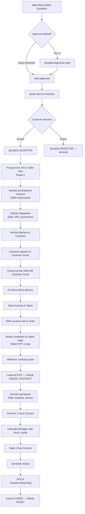

The phases of this flow that exist in **Phase 1** (Web + Customer portals + Tajeer + ZATCA):

- Quotation creation & approval (sales flow)
- E-Check + Check-out → Save Contract → SMS → Webhook → Lease ACTIVE
- Check-in → Close Contract
- Invoice generation + ZATCA sandbox submission

**Out of Phase 1** (mocked or stubbed):
- D365 PO/Fixed Asset sync (Phase 2)
- Real procurement workflow (Phase 2)
- Telematics-driven events (Phase 3)

---

## 4. Per-aggregate state machines

### 4.1 Quotation

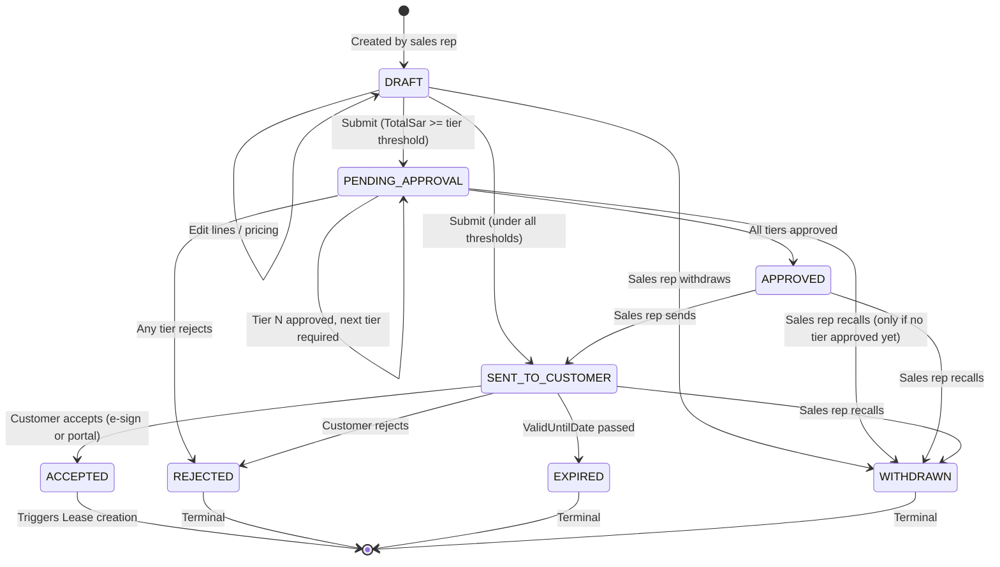

**Invariants**:

- Required approval tiers are computed at **submit time** from `ApprovalTier` config and `TotalSar`, then snapshotted into `QuotationApproval` rows. Subsequent config changes do not affect in-flight quotes.
- `WITHDRAWN` is only allowed from `DRAFT`, `PENDING_APPROVAL` (no tier approved yet), `APPROVED`, or `SENT_TO_CUSTOMER`.
- Once `ACCEPTED`, the quote is immutable. Pricing changes require a new quote (clone-and-amend).
- `EXPIRED` triggers automatically via a daily background job comparing `ValidUntilDate` to today.

> **Implementation refinement (2026-06-07, Quotation aggregate foundation)**: the diagram's
> `DRAFT → SENT_TO_CUSTOMER (under all thresholds)` edge is implemented as
> `DRAFT → APPROVED` (auto-approved, zero `QuotationApproval` rows, raises `QuotationApproved`).
> Sending stays a **distinct explicit action** (`MarkSentToCustomer`) so PDF generation /
> send-to-customer is never conflated with the approval decision. Net reachable states are
> unchanged; an under-threshold quote still requires a deliberate send step.

**Events emitted**:

| Trigger | Event |
|---|---|
| `DRAFT → PENDING_APPROVAL` | `QuotationSubmittedForApproval` |
| `PENDING_APPROVAL` tier transition | `QuotationApprovalRecorded { tierLevel, decision }` |
| Final approval | `QuotationApproved` |
| `SENT_TO_CUSTOMER` | `QuotationSentToCustomer` |
| `ACCEPTED` | `QuotationAcceptedByCustomer` → triggers lease provisioning |
| `REJECTED`/`EXPIRED`/`WITHDRAWN` | `QuotationClosed { reason }` |

### 4.2 Vehicle

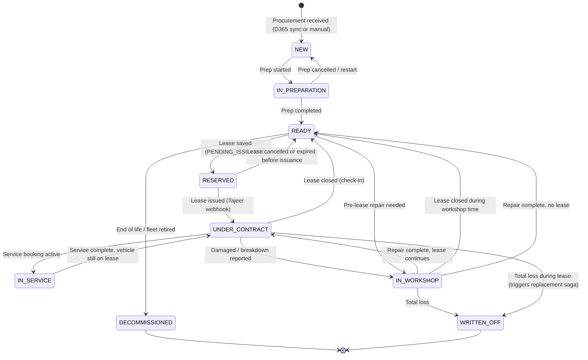

**Invariants**:

- A `Vehicle` is in **at most one** of `RESERVED` or `UNDER_CONTRACT` at any time — enforced by unique filtered index on `Lease.VehicleId WHERE Status IN ('PENDING_ISSUANCE','ACTIVE','EXTENDED','SUSPENDED')`.
- `NEW → IN_PREPARATION` requires the vehicle to have been registered in Naql (via Yakeen lookup returning ownership) — checked on prep start.
- `RESERVED` is a Phase 1 addition not in the original entity status list (doc 01) — **add it**. It distinguishes "lease saved but not yet issued" from "lease active". This matters for the 12-hour Tajeer expiry window.
- `WRITTEN_OFF` from `UNDER_CONTRACT` triggers the [Vehicle Replacement Saga](#65-vehicle-replacement-saga).
- Status changes during `UNDER_CONTRACT` (to `IN_SERVICE`, `IN_WORKSHOP`) do **not** affect Tajeer state — they're internal operations tracking.

> **Update to doc 01**: Add `RESERVED` to `Vehicle.Status` enum.

### 4.3 Lease

This is the most consequential state machine. It mirrors Tajeer's `contractStatusCode` but adds local states for the issuance/expiry window.

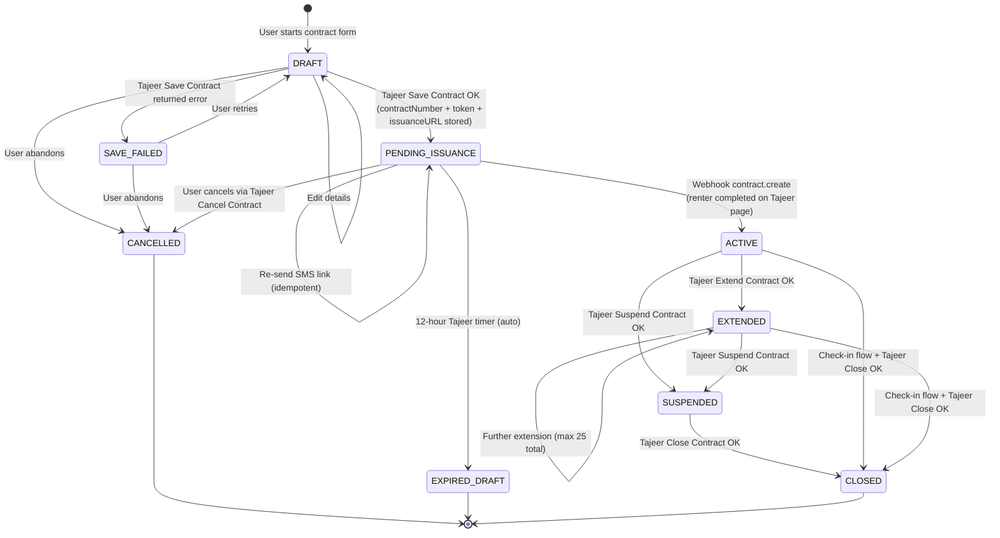

**Mapping to Tajeer `contractStatusCode`**:

| Local Status | Tajeer code (informal) | Notes |
|---|---|---|
| `DRAFT` | (none — local only) | Pre-Tajeer save |
| `SAVE_FAILED` | (none — local only) | Save errored, retryable |
| `PENDING_ISSUANCE` | 1 (saved) | Has contractNumber but not issued |
| `ACTIVE` | 4 (issued) | Renter completed e-sign on Tajeer |
| `EXTENDED` | (Tajeer keeps as ACTIVE with updated dates + extension count) | Local distinction for UI/reporting |
| `SUSPENDED` | 2 or 3 | Per Tajeer §6.10 |
| `CLOSED` | 2 (closed) | After check-in |
| `CANCELLED` | (via /cancel endpoint) | Pre-issuance cancel |
| `EXPIRED_DRAFT` | (auto-cancelled by Tajeer) | 12-hour timer; need local detection |

**Invariants**:

- Status transitions only via documented sagas (no direct DB updates from random code paths).
- `EnduranceAmountSar` is frozen after first `PENDING_ISSUANCE` — enforced at DB level via trigger (Tajeer §9.1 returns error code 316 on any modification).
- `ExtensionCount` is incremented on each `EXTENDED → EXTENDED` transition; max 25 (Tajeer rule).
- A `Lease` cannot be `CLOSED` without a `CHECK_IN` Inspection row OR a `SUSPENDED → CLOSED` path with a `returnStatus` recorded via the public update-vehicle-return-status flow (Tajeer §6.9).
- Reconciliation: a scheduled job (every 15 min) compares our `Lease.Status` to Tajeer's actual status for all leases not in terminal states; logs divergences for ops review. **Tajeer wins.**

**Events emitted**:

| Trigger | Event |
|---|---|
| `DRAFT → PENDING_ISSUANCE` | `LeaseSaved` |
| SMS dispatched | `LeaseIssuanceLinkSent` |
| `PENDING_ISSUANCE → ACTIVE` | `LeaseIssued` → triggers invoice generation, vehicle status update |
| `ACTIVE → EXTENDED` | `LeaseExtended` → may trigger pro-rata invoice |
| `* → SUSPENDED` | `LeaseSuspended { reasonCode, mojEnabled }` |
| `SUSPENDED → CLOSED` | `LeaseClosed { closureReason, subReason }` → triggers final invoice |
| `ACTIVE/EXTENDED → CLOSED` | `LeaseClosed` |
| `* → CANCELLED` | `LeaseCancelled { reason }` |
| `PENDING_ISSUANCE → EXPIRED_DRAFT` | `LeaseDraftExpired` → release vehicle reservation, refund any prepaid |

### 4.4 Invoice

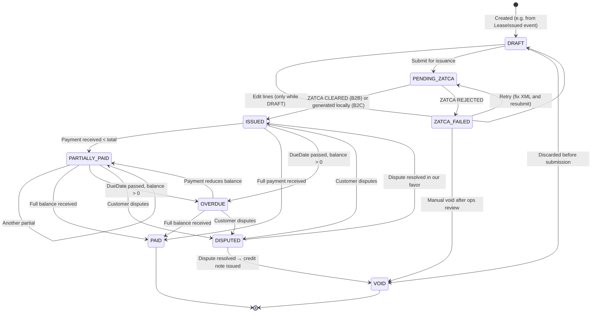

**Invariants**:

- Once `ISSUED` (B2B with ZATCA clearance, or B2C generated locally), the UBL XML and ZATCA UUID are **immutable**.
- Corrections to an `ISSUED` invoice happen via a separate **Credit Note** (`Invoice.InvoiceType = CREDIT_NOTE`) that references the original via `ReferencedInvoiceId`. Credit notes have their own ZatcaSubmission and PIH entry.
- `B2B` invoices cannot move to `ISSUED` without ZATCA clearance returning `CLEARED` or `WARNING`. `B2C` invoices move to `ISSUED` immediately; ZATCA reporting happens async within 24h.
- `OVERDUE` is a derived/computed state via daily job; can revert if payment is received.

### 4.5 ZatcaSubmission

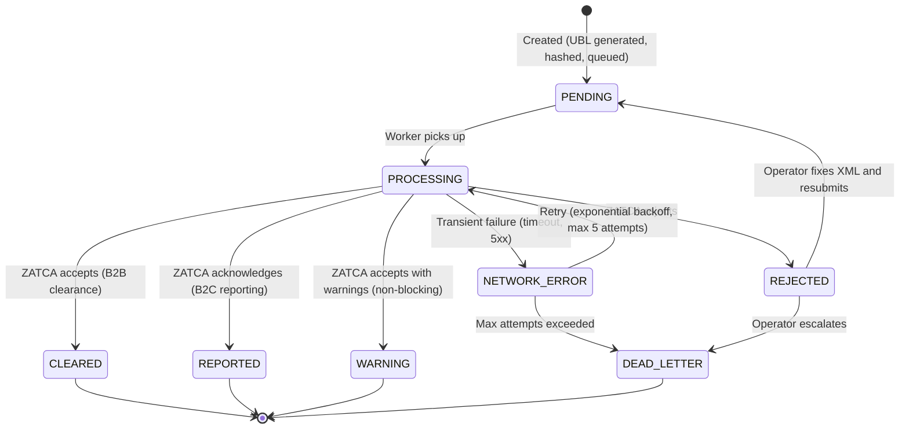

**Invariants**:

- `PreviousInvoiceHash` (PIH) is calculated at PENDING creation time and **frozen**. If PENDING is voided and recreated, recompute against current chain head.
- A `REJECTED` or `DEAD_LETTER` submission does NOT break the PIH chain — the next invoice's PIH is the last *successfully cleared* invoice's hash. This is critical for chain integrity.
- Chain head is per-tenant. Tracked in a `ZatcaChainState { TenantId, LastClearedInvoiceHash, LastClearedAtUtc }` table.

### 4.6 Inspection

Simpler — mostly create-only.

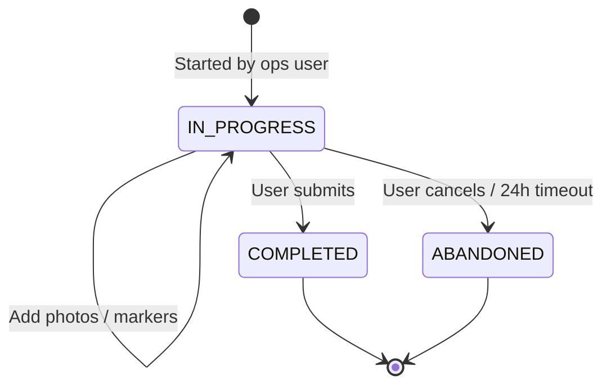

**Notes**:

- Once `COMPLETED`, immutable. Corrections require a new inspection (a `CHECK_OUT_CORRECTION` type).
- `ABANDONED` exists to support offline-mobile flows where the inspector starts but never syncs.

### 4.7 Incident

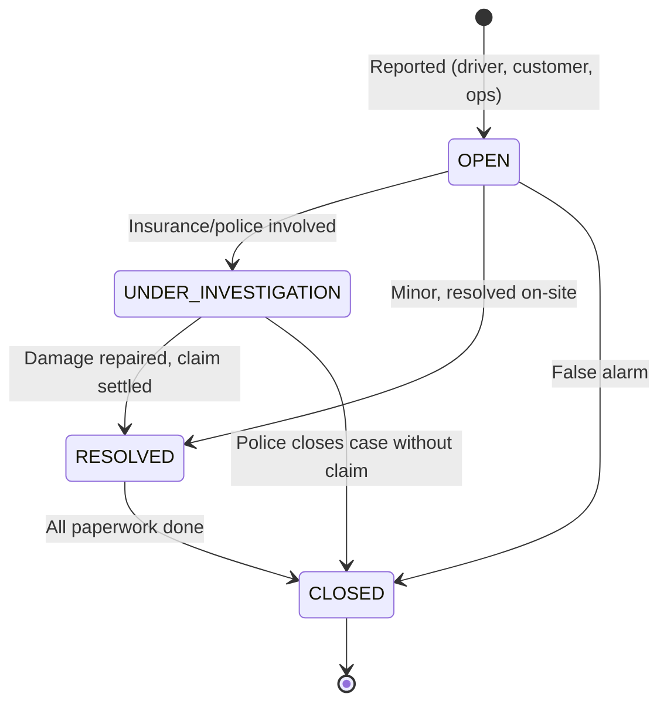

---

## 5. Domain events catalog

Events are the contract between bounded contexts and the input to sagas. Every event includes:

```json
{
  "eventId": "uuid",                  // for dedup
  "eventType": "LeaseIssued",         // string
  "tenantId": "uuid",
  "aggregateType": "Lease",
  "aggregateId": "uuid",
  "occurredAtUtc": "2026-05-17T14:30:00Z",
  "actorUserId": "uuid | null",       // null if system-triggered
  "correlationId": "uuid",            // saga trace
  "causationId": "uuid",              // prior event in chain
  "payload": { ... }                  // event-specific data
}
```

| Event | Source | Consumers |
|---|---|---|
| `QuotationSubmittedForApproval` | Quotation context | Notification (approver inbox) |
| `QuotationApprovalRecorded` | Quotation context | Quotation context (advance to next tier or mark APPROVED) |
| `QuotationApproved` | Quotation context | Notification (sales rep) |
| `QuotationSentToCustomer` | Quotation context | Notification (customer email/SMS) |
| `QuotationAcceptedByCustomer` | Quotation context | Phase 2: D365 PO trigger. Phase 1: notification only |
| `QuotationClosed` | Quotation context | Reporting |
| `VehiclePrepared` | Fleet context | Vehicle status change, notification to sales |
| `VehicleAttachedToCustomer` | Fleet context | Customer portal becomes active for them |
| `LeaseSaved` | Leasing context | Vehicle reservation, SMS dispatch |
| `LeaseIssuanceLinkSent` | Leasing context | Audit only |
| `LeaseIssued` | Leasing context (via Tajeer webhook) | Vehicle status → UNDER_CONTRACT, initial invoice generation, customer notification |
| `LeaseExtended` | Leasing context | Pro-rata invoice (if applicable), Vehicle status unchanged |
| `LeaseSuspended` | Leasing context | Customer notification, MOJ flag handling if enabled |
| `LeaseClosed` | Leasing context | Vehicle → READY, final invoice generation, customer notification |
| `LeaseCancelled` | Leasing context | Vehicle reservation released, prepaid refund (if any) |
| `LeaseDraftExpired` | Leasing context (scheduler) | Vehicle reservation released |
| `InspectionCompleted` | Operations context | Lease may advance state (e.g. CHECK_IN enables close) |
| `IncidentReported` | Operations context | Notification (ops, customer); replacement saga if severity = TOTAL_LOSS |
| `ServiceBookingScheduled` | Operations context | Vehicle → IN_SERVICE on appointment day, customer notification |
| `InvoiceGenerated` | Billing context | ZATCA submission, customer email |
| `InvoiceSubmittedToZatca` | Billing context | Audit only |
| `InvoiceCleared` | Billing context | Customer notification, invoice → ISSUED |
| `PaymentReceived` | Billing context | Invoice balance update, possible status transition |

**Event transport**:

- **In-process** for Phase 1: MediatR/handlers in the .NET BFF, with an `OutboxEvent` row for any consumer that calls an external system.
- **Phase 2+**: Azure Service Bus for inter-process / inter-service delivery as we extract services.

---

## 6. Critical sagas

### 6.1 Quote Approval Workflow Saga

**Trigger**: `QuotationSubmittedForApproval`

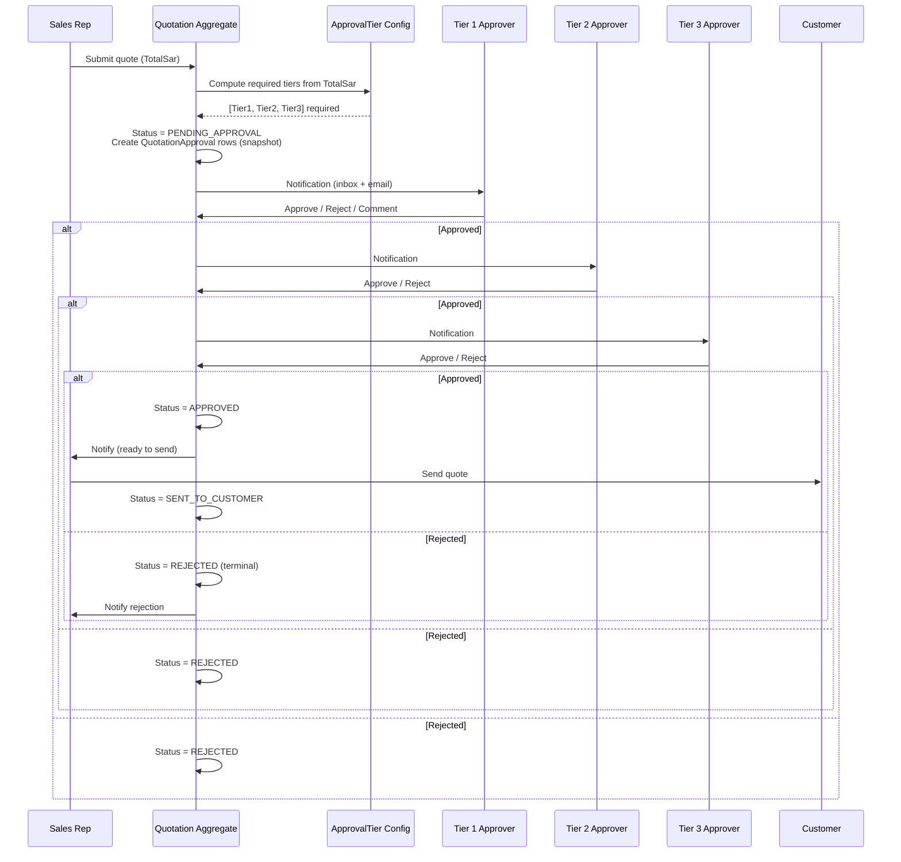

**Idempotency**:

- Tier transition is keyed on `(QuotationId, TierLevel, DecisionAtUtc)` — duplicate approval requests are silently deduped.
- Multi-approver tiers (delegation): if `QuotationApproval.AssignedUserId` is set, only that user can decide; otherwise any user with the required role can claim.

**Edge cases**:

- **Approver changes role mid-flow**: Decided by snapshot — required role is locked at submit time. If the user lost the role, an admin can reassign via `QuotationApproval.AssignedUserId`.
- **Submitter recalls during approval**: Allowed only if no tier has approved yet. Status → WITHDRAWN, all PENDING approvals → RECALLED.
- **Tier 3 not staffed**: Block submission; surface "no eligible approver for Tier 3" before allowing submit.

### 6.2 Lease Issuance Saga (the critical one)

**Trigger**: User completes contract form in Web Portal or Customer Portal and submits.

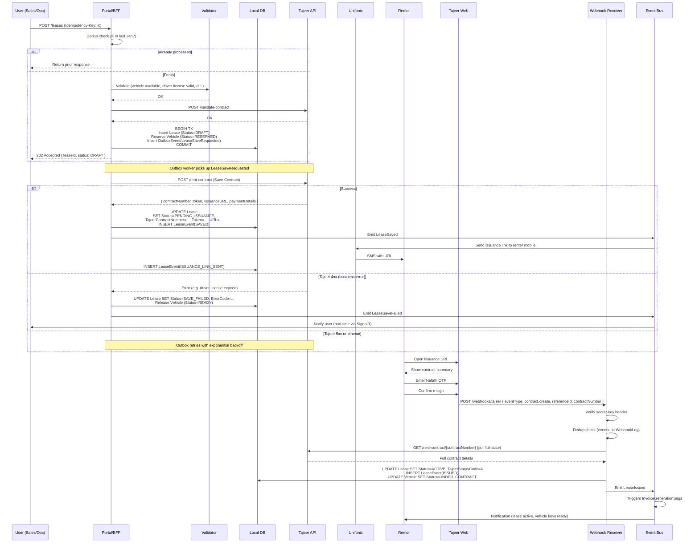

**Idempotency boundaries**:

- BFF endpoint: `Idempotency-Key` header (client-supplied UUID). Cached response for 24h.
- Outbox worker: each `OutboxEvent` has a unique ID; worker marks COMPLETED atomically before next pickup. Failure mid-process triggers retry; the receiver (Tajeer) doesn't dedupe, so a duplicate Save Contract call would create a second contract. **Mitigation**: BFF wraps the worker call with a check: if `Lease.TajeerContractNumber IS NOT NULL`, skip the Tajeer call entirely.
- Webhook receiver: dedupe on `(Source, ExternalEventId)` via unique index on `WebhookLog`.

**Failure modes & compensation**:

| Failure | Compensation |
|---|---|
| Tajeer Save Contract returns 4xx business error | Lease → SAVE_FAILED, Vehicle → READY (release), user retries with corrected data |
| Tajeer 5xx or timeout | Outbox retry with exponential backoff (max 10 attempts over 1h); if still failing, → DEAD_LETTER, ops alert |
| SMS dispatch fails | Don't block — issuance URL also shown in Portal for ops to resend manually |
| Renter doesn't complete in 12h | Tajeer auto-cancels. Our scheduler detects: Lease → EXPIRED_DRAFT, Vehicle → READY, audit trail. SMS to renter + sales rep. |
| Webhook arrives but Lease not found | Log to `WebhookLog.ProcessingError`, alert ops. Could be webhook for an old/wrong-environment contract. |
| Webhook signature invalid | Reject 401, log, alert (potential attack) |
| Vehicle reserved by another lease (race) | First commit wins (unique filtered index). Second lease save returns 409 Conflict to user. |
| Multiple webhooks for same event (Tajeer retry) | Dedup by `eventId` — silently ack with 200 |

### 6.3 Check-out Saga

**Trigger**: User initiates check-out from Web Portal or Customer Portal (vehicle delivery to driver).

Two flows:

1. **Pre-existing lease (already issued)** — straightforward, just record check-out inspection.
2. **New lease from scratch** — combined check-out + Lease Issuance Saga (above).

```mermaid
sequenceDiagram
    participant U as User
    participant P as Portal/BFF
    participant DB as DB
    participant T as Tajeer
    participant L as Lease Issuance Saga

    U->>P: Start check-out (vehicleId, driverId, contractType)
    P->>DB: Validate: vehicle READY, driver license valid, no overlapping lease
    P->>U: Show E-Check form
    U->>P: Submit E-Check (sketch, odometer, fuel, photos)
    P->>DB: BEGIN TX<br/>Insert Inspection (Type=CHECK_OUT, Status=COMPLETED)<br/>COMMIT
    P->>U: Show contract form
    U->>P: Submit contract details
    P->>L: Trigger Lease Issuance Saga
    L-->>P: Lease in PENDING_ISSUANCE
    P-->>U: "SMS sent to renter; awaiting completion"
    Note over P,T: Renter completes on Tajeer page (see saga 6.2)
    Note over P,T: On LeaseIssued event: Vehicle → UNDER_CONTRACT
```

**Edge cases**:

- **E-Check submitted but contract save fails**: Inspection remains as `COMPLETED` with no `LeaseId`. UI shows "Inspection saved as draft; retry contract creation" — inspection is reused on retry (don't make user redo photos).
- **Offline mobile E-Check**: Sketch + photos stored in local SQLite on mobile app, synced when online. Conflict if vehicle is in different status by sync time → ops review.

### 6.4 Check-in / Close Contract Saga

**Trigger**: Vehicle returned by renter. Initiated from Web Portal (typically by ops at branch).

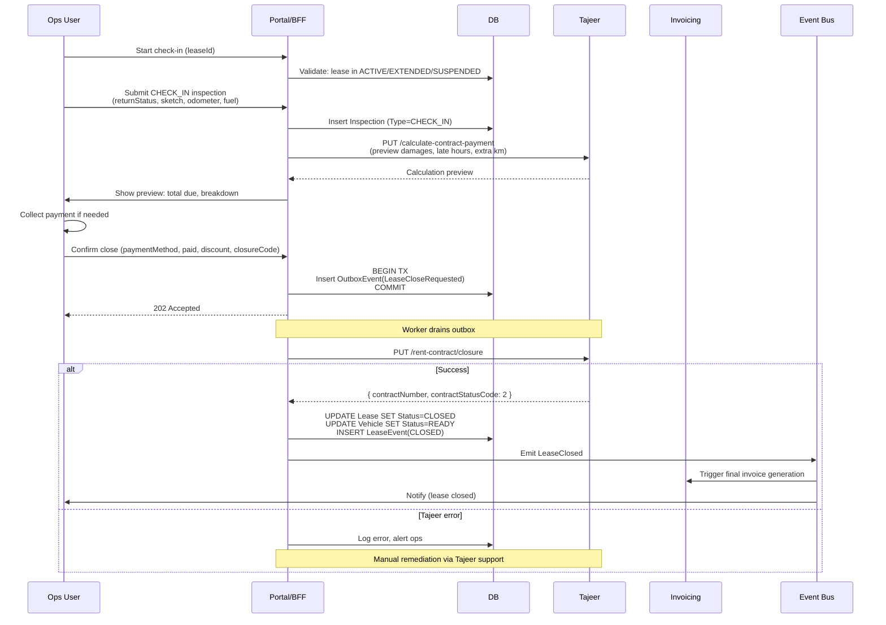

**Edge cases**:

- **Damage requires repair before close**: Use Suspend Contract (reason: NON_TRAFFIC_DAMAGE) first, then Close after repair.
- **Disputed damages**: Inspection records the damages; payment can be partial; balance remains as overdue invoice.
- **Renter not present at check-in**: Tajeer supports update-vehicle-return-status via public page for renter to confirm later (§6.9). Close goes through anyway with ops attestation.

### 6.5 Vehicle Replacement Saga

**Trigger**: `IncidentReported { severity: TOTAL_LOSS }` OR explicit replacement request OR scheduled service requiring extended downtime.

This is the **most dangerous saga** because it spans two leases, two vehicles, two Tajeer contracts, and at least one invoice. Phase 2 should consider Azure Durable Functions for reliable orchestration.

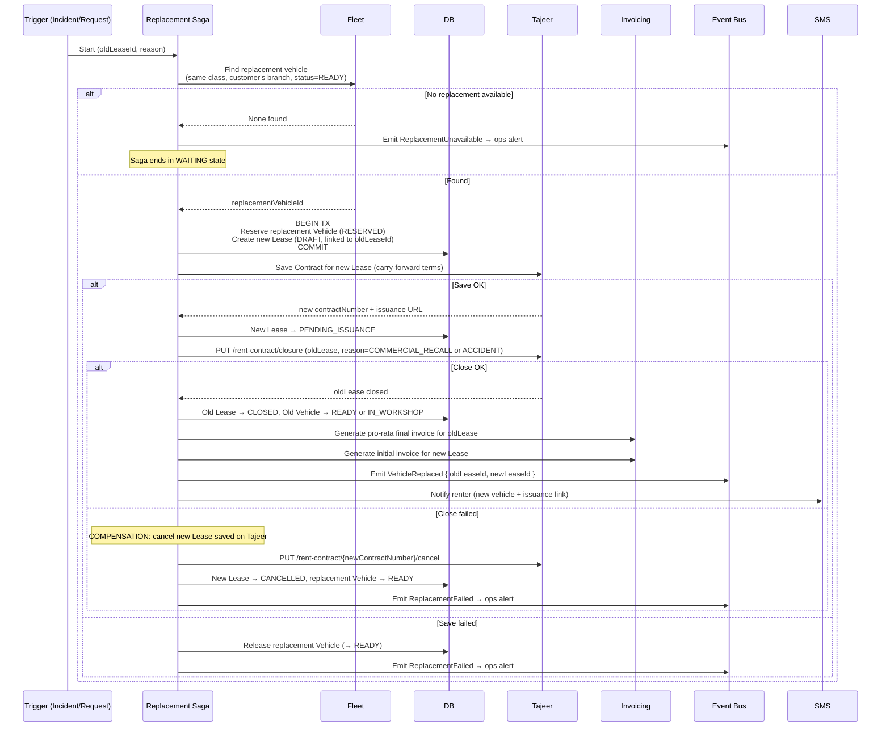

**Critical compensation rules**:

- If Tajeer Close of old contract succeeds but New Save fails: the old lease is closed, but no replacement exists. State: `STUCK_PENDING_REPLACEMENT` — ops dashboard surfaces; manual reissue.
- If Tajeer Save of new succeeds but Close of old fails: both leases exist, two vehicles for one customer. Compensation cancels the new contract.
- **Saga state persistence**: Save saga state in `SagaInstance` table at each step. On restart (e.g. after deployment), resume from last step.

### 6.6 ZATCA Invoice Submission Saga

**Trigger**: `InvoiceGenerated` event with `InvoiceType IN ('STANDARD', 'CREDIT_NOTE', 'DEBIT_NOTE')`.

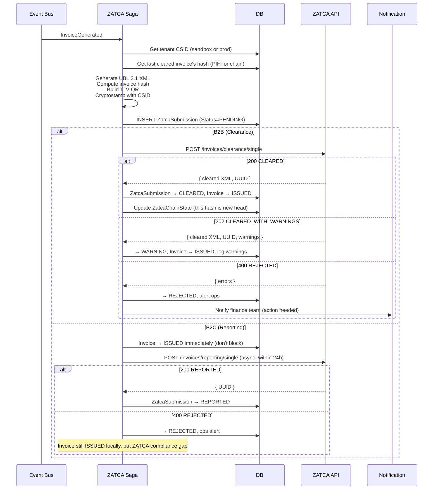

**PIH chain integrity rules**:

- A `REJECTED` submission does NOT advance the chain — next invoice's PIH is still the last `CLEARED` hash.
- If PIH chain is detected as broken (mismatch on submit), alert immediately and halt new submissions until reconciled. This is a regulatory issue.
- Per-tenant chain state in `ZatcaChainState` table — single-row-per-tenant updated atomically.

**Retry strategy**:

- Network errors / 5xx: exponential backoff, max 5 attempts over 30 min.
- After max retries → DEAD_LETTER, ops dashboard alert.
- Rejected (4xx): no automatic retry; needs human review (XML issue, data issue, or schema change).

---

## 7. Idempotency strategy

| Layer | Idempotency mechanism | Storage | TTL |
|---|---|---|---|
| Inbound HTTP endpoints | `Idempotency-Key` header (UUID); BFF caches `(key, requestHash, response)` | Redis | 24h |
| Webhook receivers | `WebhookLog.UNIQUE(Source, ExternalEventId)` | SQL | Forever (audit) |
| Outbox worker → external API | Check aggregate state before calling (e.g., `if Lease.TajeerContractNumber IS NOT NULL skip Save`) | SQL | N/A |
| Domain event handlers | `(handlerName, eventId)` dedup row before processing | SQL or Redis | 7 days |
| Background jobs / schedulers | Single-instance lock via Azure Storage blob lease or SQL `sp_getapplock` | Azure Storage / SQL | Per job |

**Hash strategy for `requestHash`**: SHA-256 over `(method, path, sorted query, body)` — excludes auth headers. If two requests come with same key but different hash, return 422 Unprocessable Entity (client bug).

---

## 8. Reversibility & compensation

Classifying each external action by reversibility:

| Action | Reversible? | Compensation |
|---|---|---|
| Tajeer **Save Contract** (saved, not issued) | Yes | `PUT /cancel` within 12h |
| Tajeer **Save Contract** (issued, ACTIVE) | No — can only close | `PUT /closure` with reason |
| Tajeer **Extend Contract** | No | Open extension request to support; in-system reflect as "extended back" via reopening (not supported by API) |
| Tajeer **Suspend Contract** | Partially | Can transition SUSPENDED → CLOSED, but not back to ACTIVE |
| Tajeer **Close Contract** | No | Terminal. Disputes via new credit invoice. |
| ZATCA **Clearance** | No | Issue Credit Note (separate invoice) |
| SMS dispatch | No | Send corrective SMS |
| Vehicle reservation (local) | Yes | Release reservation |
| Lease creation (local DRAFT) | Yes | Mark CANCELLED, delete after retention period |
| Invoice DRAFT | Yes | VOID |
| Invoice ISSUED | No | Credit Note |
| Payment record | Partial | Refund record (separate Payment with negative amount) |

**Saga design rule**: Order steps from **most reversible** to **least reversible**. The least-reversible action goes last so failure of an earlier step doesn't leave an irreversible commit hanging.

---

## 9. Edge cases & error handling

### 9.1 The 12-hour Tajeer expiry

Tajeer auto-cancels any Saved (un-issued) contract after 12 hours. We need:

- **Detection**: Scheduled job every 15 min, checks `Lease.Status = PENDING_ISSUANCE AND SavedAtUtc < UTCNOW - 12h`. Marks as `EXPIRED_DRAFT`, releases vehicle, notifies user.
- **UX**: Show countdown ("Renter must complete within Xh Ym") in Portal next to pending leases.
- **Reminder SMS**: At T-2h, send reminder SMS to renter.

### 9.2 Webhook ordering not guaranteed

Tajeer doesn't guarantee event order. After any event:

- Always do `GET /rent-contract/{contractNumber}` to fetch authoritative state.
- Map response to local state. Resolve divergence in favor of Tajeer.

### 9.3 Concurrent modifications

- **Two ops users editing the same lease**: Optimistic concurrency via `RowVersion` column. Second submit fails with 409 + "version changed by [user] at [time]".
- **Vehicle race (two leases trying to reserve same vehicle)**: Unique filtered index on active leases. Second commit fails with PK violation, translated to 409 Conflict.

### 9.4 Tajeer API outage

- Save/Close/Extend calls go via outbox → worker keeps retrying with exponential backoff.
- Portal UI shows pending lease as "Awaiting Tajeer sync" with retry count.
- After 1 hour of failures, `OutboxEvent` → DEAD_LETTER; ops dashboard surfaces; admin can manually retry or cancel.
- **Read operations** (GET contract, lookups): cached responses serve until reconnect; UI shows freshness indicator.

### 9.5 ZATCA outage

- Reporting (B2C): no impact — async submission queues up, drains when ZATCA returns.
- Clearance (B2B): blocks invoice issuance. Options:
  1. Hold invoices in `PENDING_ZATCA` until clearance succeeds (default).
  2. After 30 min, fall back to B2C reporting mode + ops alert (regulatory call — discuss with compliance before implementing).

### 9.6 Tajeer rejects extend (max 25 reached)

Surface clearly: "This contract has reached the 25-extension limit. Close current contract and start a new one." Provide one-click flow to do exactly that (Close + immediate New Lease creation pre-filled with same details).

---

## 10. Open questions

| # | Question | Default |
|---|---|---|
| Q1 | Should `Vehicle.Status = RESERVED` be added to the enum? (Doc 01 didn't include it) | **Yes** — add to doc 01. Reserved is distinct from Under Contract. |
| Q2 | Should the Replacement Saga be in-process MediatR (Phase 1) or Azure Durable Functions from the start? | In-process Phase 1; migrate to Durable in Phase 2 once we have one running |
| Q3 | If a webhook arrives for a Lease whose local status is already `ACTIVE`, do we re-process? | Idempotent re-process: pull `GET /rent-contract`, reconcile if needed, but skip side effects (invoice, vehicle status) that already fired |
| Q4 | How do we handle the case where the renter's Nafath OTP fails repeatedly on Tajeer's page? | Tajeer surfaces this on their page; we don't see it. Our 12h expiry job catches abandoned contracts. Add a "renter reported issues" feedback link in the SMS message for support. |
| Q5 | Should we proactively call Tajeer's reconciliation GET on every active lease daily to detect divergence? | Yes — nightly job for all non-terminal leases. Cost is one Tajeer API call per active lease per day; should be fine within rate limits. |
| Q6 | For B2C invoices that need ZATCA reporting within 24h: should we batch or stream? | Stream — submit each invoice individually as soon as generated. Simpler retry semantics. |

---

## 11. Resolved decisions from doc 01 §9

For the record, I'm proceeding with these defaults (you can override later):

| # | Decision | Status |
|---|---|---|
| Q1 (doc 01) | SQL Always Encrypted for `Person.IdNumber`, `DriverLicenseNumber`, IBAN | ✅ Applied |
| Q2 (doc 01) | Snapshot rent policy text into Lease at issuance | ✅ Applied |
| Q3 (doc 01) | Auto-set `EXPIRED_DRAFT` via scheduled job; clone-and-resave on user retry | ✅ Applied (see §9.1) |
| Q4 (doc 01) | `Driver` scoped per `Customer` | ✅ Applied |
| Q5 (doc 01) | `Invoice.LineNumber` per-invoice starting at 1 | ✅ Applied |
| Q6 (doc 01) | Single normalized `Vehicle.PlateNumber` string | ✅ Applied |
| Q7 (doc 01) | Model `Tenant` table from day 1 | ✅ Applied |

---

## 12. Next docs

After this is signed off:

- **03 — Tajeer Adapter Interface & State Mapping** (concrete C# interfaces, error code mapping, retry policies)
- **04 — BFF API Surface (OpenAPI)** — REST endpoints the portals call
- **05 — ZATCA Invoice Generation Design** — UBL details, library choice, EGS lifecycle
- **06 — Approval Workflow Engine** — config schema, evaluator, delegation
- **07 — Monorepo Layout & Build System** (Turborepo + .NET)

---

## 13. Sign-off checklist

- [ ] State machines for Quotation, Vehicle, Lease, Invoice, ZatcaSubmission approved
- [ ] `RESERVED` added to `Vehicle.Status` enum in doc 01
- [ ] Domain event catalog approved
- [ ] Lease Issuance Saga (§6.2) approved as the canonical orchestration
- [ ] Idempotency strategy approved
- [ ] Reversibility table approved
- [ ] Open questions §10 answered
